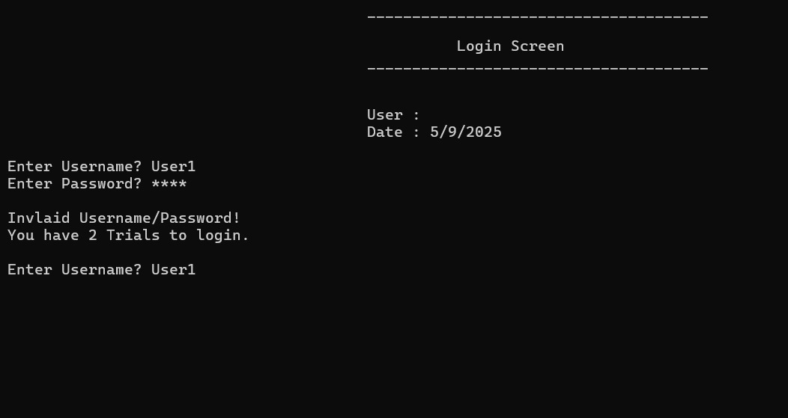
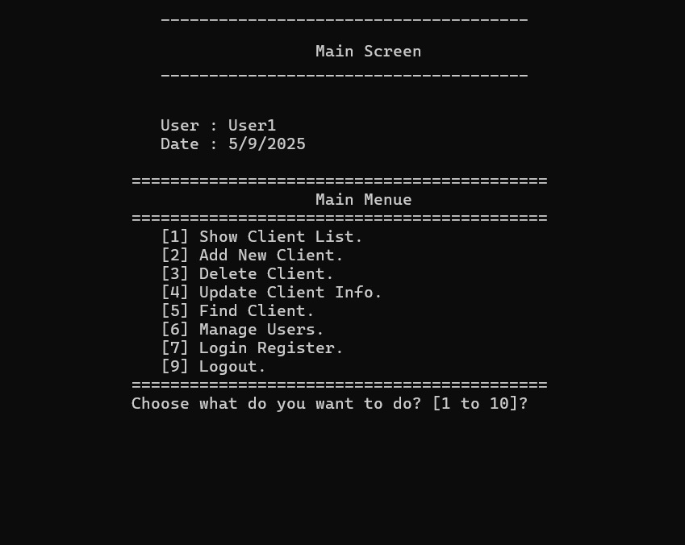
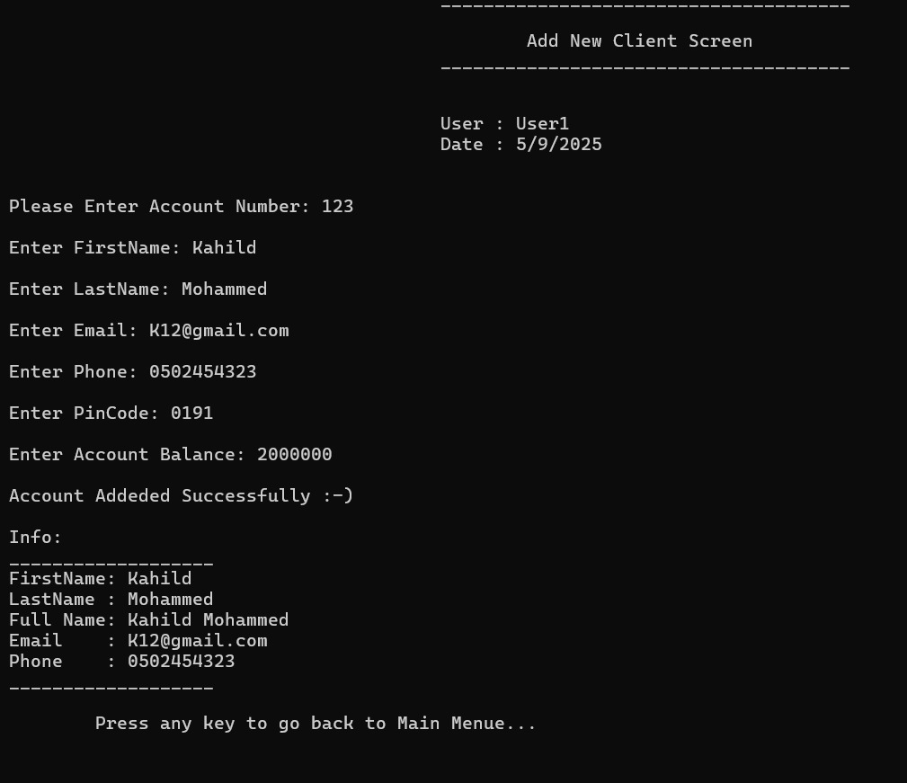
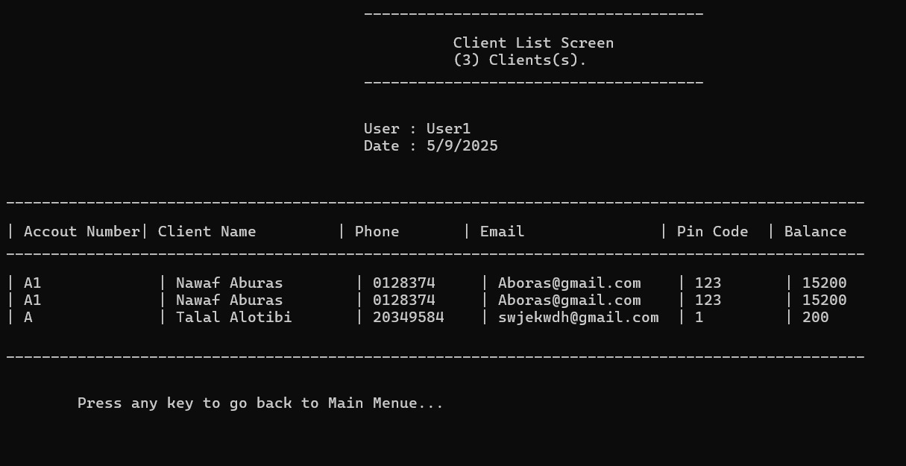

# Full-Bank-System

A complete console-based banking system developed entirely in **C++**.  
The project simulates a banking environment where users can manage client accounts, perform transactions, and control user access with secure login and role-based authorization.

All modules (authentication, transaction handling, file persistence, and input validation) were built completely from scratch without relying on third-party libraries.

---

## Project Objective
To design and implement a secure, modular banking system while practicing Object-Oriented Programming (OOP) in C++.  
This project helped me **understand how to deal with large and complex systems**, from structuring modules and handling data persistence to enforcing secure login and user management.

>هذا المشروع علّمني كيف أتعامل مع **الأنظمة الكبيرة والمعقدة** من حيث تنظيم الوحدات، وحفظ البيانات في الملفات، وإدارة المستخدمين وتطبيق الدخول الآمن.

---

## Technologies Used
- **Language:** C++  
- **Application Type:** Console Application  
- **Data Storage:** File-based persistence (TXT files)  
- **Platform:** Windows Desktop (x64)

---
## Some Screenshots

  
  
  
  

---
## Project Structure
Full-Bank-system/
├── Clients.txt                 # Stores client data
├── Users.txt                   # Stores system users
├── Currencies.txt              # Stores currency data
├── LoginRegister.text          # Login history and audit
├── Main Screen.cpp             # Main application logic
├── ClsString.h                 # String utility functions
├── ClsDates.h                  # Date/time utilities
├── ClsPeriod.h                 # Period calculations
├── clsBankClient.h             # Client class definition
├── clsUser.h                   # User class definition
├── clsPerson.h                 # Base class for person info
├── clsScreen.h                 # Generic screen handler
├── clsAddNewClientScreen.h     # Screen for adding clients
├── clsDeleteClientScreen.h     # Screen for deleting clients
├── clsUpdateClientScreen.h     # Screen for updating client info
├── clsFindClientScreen.h       # Screen for searching clients
├── clsClientListScreen.h       # Screen for showing clients
├── clsDepositClientScreen.h    # Screen for deposits
├── clsWithdrawClientScreen.h   # Screen for withdrawals
├── clsTransferLogClientScreen.h# Transaction log screen
├── clsWireTransferClientScreen.h # Wire transfer logic
├── clsTotalBalancesClientScreen.h # Show total balances
├── clsCurrencyExchangeScreen.h # Currency exchange screen
├── clsCurrencyListScreen.h     # Currency list
├── clsUpdateCurrencyRateScreen.h # Update currency rates
├── clsManageUsersScreen.h      # User management
├── clsLoginRegisterUsersScreen.h # Login register view
├── Interfacecommunication.h    # Console I/O handling
├── OOP 11.vcxproj / filters / user # Visual Studio project files
└── x64/Debug/                  # Compiled binaries

---

## Getting Started
1. **Clone** the repository.  
2. **Open** the `.sln` or `.vcxproj` in **Visual Studio 2019+**.  
3. **Build** in **x64** (Debug/Release).  
4. **Run** the application from the console.

---

## Key Features
- **Secure Login** with limited trials on invalid attempts  
- **Role-Based Access Control** for users  
- **Client Management:** add, update, delete, search  
- **Transactions:** deposits, withdrawals, transfers  
- **Currency Module:** view/update rates & exchange calculation  
- **Audit Logs:** login/register activity tracking  
- **File Persistence:** data stored in `.txt` files

---

## Feedback
For suggestions or improvements, please open an issue or contact directly.
